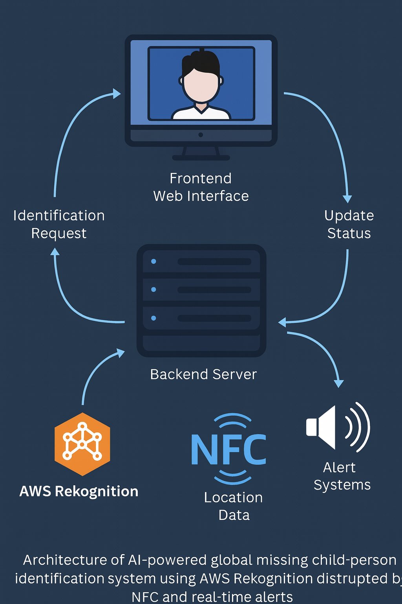

# Global Missing Child/Person Identification Network – System Architecture

## Overview
This architecture shows how the system processes images, performs facial recognition, triggers alerts, and logs last-seen location data.

## Workflow Summary
1. **Frontend Upload**  
   User uploads image via the frontend (HTML/CSS/JS static UI).

2. **API Layer**  
   The image request passes through API Gateway.

3. **Lambda Processing**  
   - Pre-process image  
   - Store in S3  
   - Call Amazon Rekognition for matching  

4. **Rekognition Face Search**  
   Rekognition compares uploaded image with stored missing-person images.

5. **DynamoDB Storage**  
   High-confidence matches saved with metadata.

6. **SNS Alerts**  
   Alert SMS/email triggered to guardian/NGO/police volunteers.

7. **Location Tracking**  
   Amazon Location Service logs last-seen coordinates on the dashboard.

8. **Dashboard Hosting**  
   CloudFront + S3 serve the web dashboard.

9. **NFC Tag Workflow**  
   NFC tap → Lambda → Fetch child profile → Trigger alerts.
